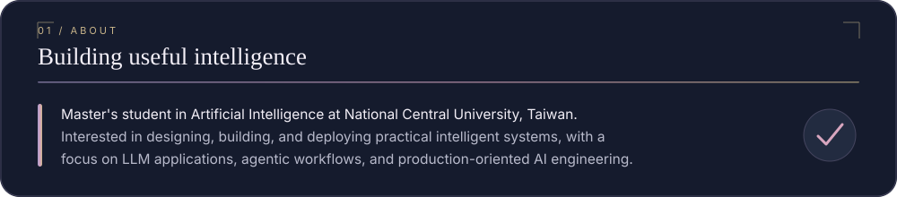
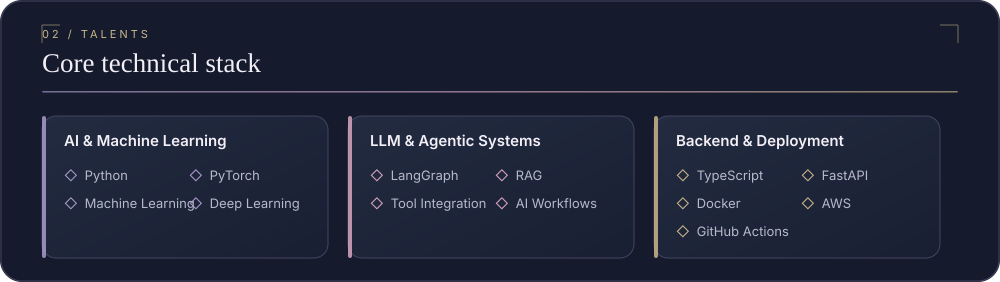
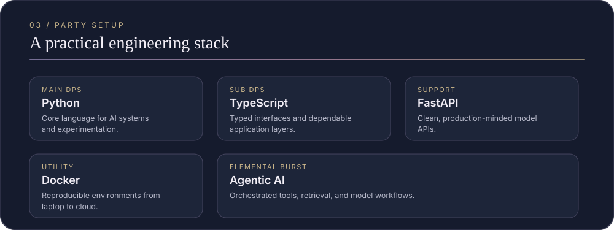
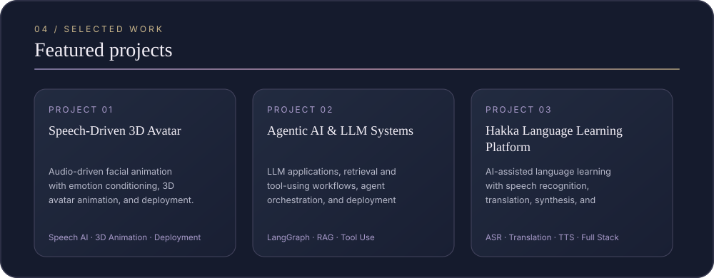
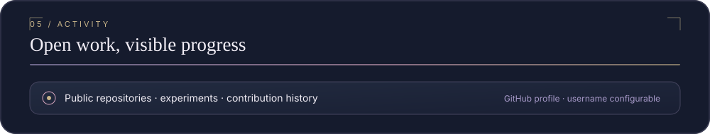

<!-- Generated by npm run build. Edit data/profile.json or the generators, not this file. -->

<picture>
  <source media="(prefers-reduced-motion: reduce)" srcset="assets/hero-static.svg">
  
</picture>

Master's student in Artificial Intelligence at National Central University, Taiwan. Interested in designing, building, and deploying practical intelligent systems, with a focus on LLM applications, agentic workflows, and production-oriented AI engineering.

**AI & Machine Learning:** `Python` · `PyTorch` · `Machine Learning` · `Deep Learning`  
**LLM & Agentic Systems:** `LangGraph` · `RAG` · `Tool Integration` · `AI Workflows`  
**Backend & Deployment:** `TypeScript` · `FastAPI` · `Docker` · `AWS` · `GitHub Actions`

**Main DPS:** Python · **Sub DPS:** TypeScript · **Support:** FastAPI · **Utility:** Docker · **Burst:** Agentic AI

- **Speech-Driven 3D Avatar** — Audio-driven facial animation with emotion conditioning, 3D avatar animation, and deployment.  
  `Speech AI` · `3D Animation` · `Deployment`

- **Agentic AI & LLM Systems** — LLM applications, retrieval and tool-using workflows, agent orchestration, and deployment experiments.  
  `LangGraph` · `RAG` · `Tool Use`

- **Hakka Language Learning Platform** — AI-assisted language learning with speech recognition, translation, synthesis, and full-stack deployment.  
  `ASR` · `Translation` · `TTS` · `Full Stack`

Public repositories, experiments, and contribution history are available directly from this GitHub profile.

---

Designing, building, and deploying practical intelligent systems. Dream-themed portrait generated with OpenAI image generation tools; no official HoYoverse artwork is included. <a href="assets/ASSET_SOURCES.md">Asset notes</a>.

