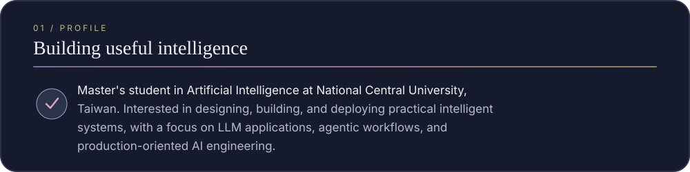
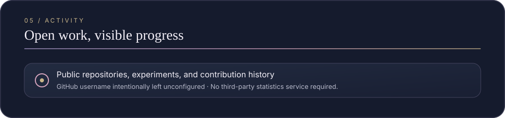

<!-- Generated by npm run build. Edit data/profile.json or the generators, not this file. -->

## Profile

## Talents

## Party Setup

## Featured Projects

## GitHub Activity

Repository links and contact details can be enabled in `data/profile.json` when ready.

Designing, building, and deploying practical intelligent systems.

 

Dream-themed portrait generated with OpenAI image generation tools; this repository does not include official HoYoverse artwork. See <a href="assets/ASSET_SOURCES.md">asset notes</a>.

